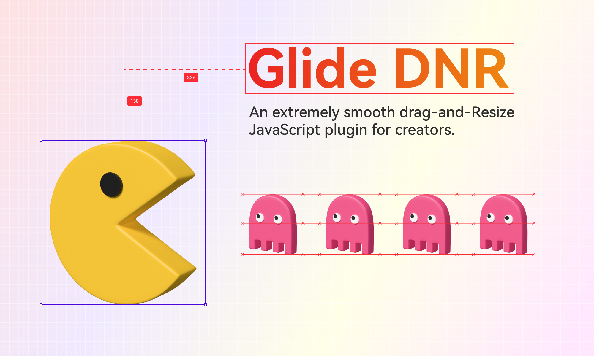

GlideDNR(drag-and-resize)
---

An extremely smooth drag-and-resize JavaScript plugin for creators. GlideDNR is written with [Web Components](https://developer.mozilla.org/en-US/docs/Web/API/Web_components),which is natively supports any framework (vue, react……), especially original html and js.

