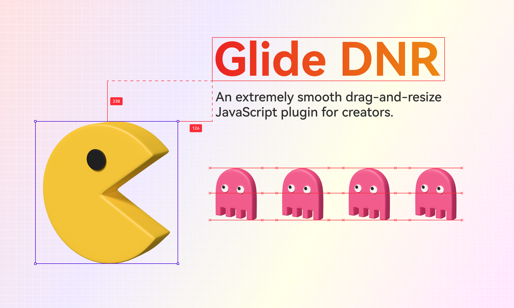

GlideDNR(drag-and-resize)
---

An extremely smooth drag-and-resize JavaScript plugin for creators. GlideDNR is written with [Web Components](https://developer.mozilla.org/en-US/docs/Web/API/Web_components), which natively supports any framework (vue, react……), especially original html and js.



If you don't see the cover image above, you need to use VPN to reload the page again.

### Demo
The [Demo](https://chnkarl.github.io/glide-dnr/storyboard.html) show how the plugin works.

### Install
```
npm i glide-dnr
```

### Usage

#### Step 1: import Glide DNR

import as a module
```
import { GlideDNR, GlideDNRItem } from "glide-dnr"
```

or use CDN directly
```
import { GlideDNR, GlideDNRItem } from "https://cdn.jsdelivr.net/npm/glide-dnr@1.0.12/index.js"
```

#### Step 2
```
<glide-dnr id="glide-dnr" toolbar measure toolbar-placement="float">
  # image element
  # you can set type attribute as image, to resize image element smoothly without stuck occasionally.
  <glide-dnr-item 
    type="image" 
    id="id-001" 
    width="120" 
    left="240" 
    top="100"
  >
    
  </glide-dnr-item>

  # other element
  <glide-dnr-item 
    id="id-004" 
    left="250" 
    top="280" 
    style="
    font-size: 70px; 
    font-weight: 700;
    background: linear-gradient(90deg, red, orange); 
    -webkit-background-clip: text; 
    background-clip: text; 
    -webkit-text-fill-color: transparent;color: red;"
  >
  Glide DNR
  </glide-dnr-item>
</glide-dnr>
```

### Attributes

#### toolbar
show toolbar like: alignments, distribution

#### measure
show measurement button on toolbar, which allow u measure distance between selected and target(mouse on)

#### toolbar-placement
set toolbar placement, the value is float or top，the default value is float

#### color-primary
set primary color like: hex or rgb

#### modify-outside
allow you to modify glide-dnr-item attributes(left,top,width,height) value outside the component

### Methods

#### onSelect
```
const GlideDNR = document.querySelector("#glide-dnr")

GlideDNR.addEventListener("onSelect", (e) => {
  console.log("e.detail: ", e.detail)
})
```

#### onChange
```
const GlideDNR = document.querySelector("#glide-dnr")

GlideDNR.addEventListener("onChange", (e) => {
  console.log("e.detail: ", e.detail)
})
```

#### onMouseDown
```
const GlideDNR = document.querySelector("#glide-dnr")

GlideDNR.addEventListener("onMouseDown", (e) => {
  console.log("e.detail: ", e.detail)
})
```

#### onMouseUp
```
const GlideDNR = document.querySelector("#glide-dnr")

GlideDNR.addEventListener("onMouseUp", (e) => {
  console.log("e.detail: ", e.detail)
})
```

### Advanced Usage

#### Update content of Glide-dnr-item

##### Update general item
```
const elSetContent = document.getElementById("set_content")

if (elSetContent !== null) {
  elSetContent.addEventListener("input", (e) => {
    const elSelected = document.querySelector(`#${selectedId}`)

    if (elSelected !== null) {

      # update
      elSelected.innerText = e.target.value

      # this is a inner method of GlideDNR which need to be used after the element content is updated.
      elButterBoard.renderItem(elSelected)
    }
  })
}
```

##### Update image item
```
#form-image-01 is a button，which is used to update image src attribute.
const elSetUpload01 = document.getElementById("form-image-01")

if (elSetUpload01 !== null) {

  elSetUpload01.addEventListener("click", (e) => {

    if (selectedId !== "") {

      const elSelected = document.querySelector(`#${selectedId}`)

      if (elSelected !== null) {
        const htmlString = `
          
        `

        # update
        elSelected.innerHTML = htmlString

        # this is a inner method of GlideDNR which need to be used after the element content is updated.
        elButterBoard.renderImageItem(elSelected)
      }
    }
  })
}
```

### Framework Supportion

if you haven't used web component before in Js framework, here are some suggestions to read before:

[React](https://legacy.reactjs.org/docs/web-components.html)

[Vue](https://vuejs.org/guide/extras/web-components.html)

[Angular](https://angular.love/angular-web-components-a-complete-guide/)

